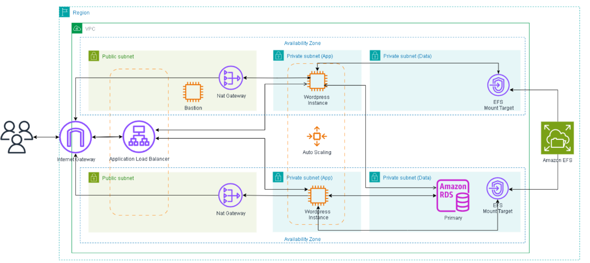

# Projeto: WordPress em Alta Disponibilidade na AWS

Este repositório documenta a implementação de uma arquitetura de alta disponibilidade para a plataforma WordPress na nuvem AWS. O objetivo é implantar o WordPress de forma escalável e tolerante a falhas, utilizando os principais serviços gerenciados da AWS para garantir desempenho e disponibilidade, simulando um ambiente de produção real.

## Arquitetura Proposta

A arquitetura final distribui a aplicação em múltiplas instâncias EC2, gerenciadas por um Auto Scaling Group e com o tráfego balanceado por um Application Load Balancer. O armazenamento de arquivos é centralizado no Amazon EFS, e os dados são gerenciados por um banco de dados relacional Amazon RDS.



---

## Configuração da Arquitetura

Esta seção detalha a função e a configuração de cada componente implementado no projeto.

### Fase 1: Fundação de Rede (VPC)

**Função:** A VPC (Virtual Private Cloud) atua como a fundação da nossa arquitetura, criando uma rede privada e logicamente isolada na nuvem da AWS. Isso nos dá controle total sobre o ambiente de rede, permitindo-nos projetar uma topologia segura que protege nossos recursos internos.

1.  **Topologia da Rede:** A VPC (`wordpress-vpc`) foi projetada com um espaço de IPs (`10.0.0.0/16`) e segmentada em sub-redes distribuídas em duas Zonas de Disponibilidade para alta resiliência:
    * **Sub-redes Públicas:** Duas sub-redes (`10.0.1.0/24`, `10.0.2.0/24`) foram designadas para recursos com acesso à internet, como o Load Balancer. A conectividade é provida por um **Internet Gateway**.
    * **Sub-redes Privadas:** Duas sub-redes (`10.0.3.0/24`, `10.0.4.0/24`) foram designadas para proteger os recursos de back-end. O acesso à internet para atualizações é feito de forma segura através de um **NAT Gateway**.

### Fase 2: Camada de Segurança (Security Groups)

**Função:** Os Security Groups atuam como firewalls dinâmicos para os recursos, controlando o tráfego com base em regras específicas para cada camada da aplicação, aplicando o princípio do menor privilégio.

1.  **`wordpress-db-sg` (RDS):** Protege o banco de dados, permitindo conexões na porta `3306` exclusivamente a partir das instâncias da aplicação (`wordpress-ec2-sg`).
2.  **`wordpress-efs-sg` (EFS):** Protege o sistema de arquivos, permitindo tráfego na porta `2049` (NFS) somente a partir das instâncias da aplicação.
3.  **`wordpress-alb-sg` (Load Balancer):** Define a porta de entrada da aplicação, permitindo tráfego público na porta `80` (HTTP).
4.  **`wordpress-ec2-sg` (Instâncias EC2):** Isola os servidores, permitindo tráfego web na porta `80` apenas vindo do Load Balancer, e acesso administrativo na porta `22` (SSH).

### Fase 3: Camada de Persistência de Dados (RDS & EFS)

**Função:** Um pilar da arquitetura é separar os dados da computação. Isso torna as instâncias EC2 "descartáveis", pois os dados importantes são armazenados de forma persistente e segura em serviços gerenciados, o que é essencial para a alta disponibilidade.

1.  **Amazon EFS (`wordpress-efs`):**
    * **O que faz:** Provê um sistema de arquivos de rede compartilhado e centralizado para a pasta `wp-content` do WordPress, garantindo que todas as instâncias EC2 sirvam os mesmos temas, plugins e arquivos de mídia.
    * **Configuração:**
        * No console do EFS, um novo sistema de arquivos foi criado com o nome `wordpress-efs` na `wordpress-vpc`.
        * Para garantir a conectividade e resiliência, foram criados **Mount Targets** em cada uma das **sub-redes privadas**, ambos associados ao Security Group `wordpress-efs-sg`.
        * Um ajuste crítico realizado na `wordpress-vpc` foi a habilitação das opções **"Enable DNS resolution"** e **"Enable DNS hostnames"**.

2.  **Amazon RDS (`wordpress-db`):**
    * **O que faz:** Provê um banco de dados MySQL gerenciado para armazenar todos os dados do site (posts, usuários, etc.), reduzindo a carga operacional de manutenção.
    * **Configuração:**
        * **Grupo de Sub-redes:** Primeiro, um "Grupo de Sub-redes de Banco de Dados" (`wordpress-db-subnet-group`) foi criado para agrupar as duas **sub-redes privadas**, isolando o banco de dados.
        * **Criação da Instância:** A instância (`wordpress-db`) foi criada usando o mecanismo `MySQL` e o modelo de `Nível gratuito`. Foi configurada com a classe `db.t3.micro`, sem acesso público, na `wordpress-vpc`, utilizando o `wordpress-db-subnet-group` e o Security Group `wordpress-db-sg`.
        * **Banco de Dados Inicial:** Na configuração, o "Nome do banco de dados inicial" foi definido como `wordpress` para simplificar a conexão da aplicação.

### Fase 4: Camada de Aplicação e Automação (EC2, ALB, ASG)

**Função:** Esta é a camada dinâmica, responsável por executar o WordPress, distribuir a carga e garantir a resiliência do sistema.

1.  **Launch Template (`wordpress-lt`):**
    * **O que faz:** Serve como um "molde" padronizado para a criação de instâncias EC2, garantindo consistência.
    * **Configuração:** Foi criado um modelo com o nome `wordpress-lt`, utilizando a AMI **Amazon Linux 2023**, tipo de instância `t2.micro`, o par de chaves correto e o Security Group `wordpress-ec2-sg`. No campo "Dados do usuário", foi inserido o script `user-data`.

2.  **Application Load Balancer (ALB) (`wordpress-alb`):**
    * **O que faz:** Atua como o ponto de entrada único e inteligente para todo o tráfego do site.
    * **Configuração:**
        * **Grupo de Destino:** Foi criado um "Grupo de Destino" (`wordpress-tg`) para `Instâncias` na `wordpress-vpc`, operando com o protocolo `HTTP:80`. Nenhum destino foi registrado manualmente.
        * **Load Balancer:** Foi provisionado um `Application Load Balancer` (`wordpress-alb`), `Voltado para a Internet`. Ele foi mapeado para operar nas duas **sub-redes públicas** e protegido pelo Security Group `wordpress-alb-sg`. A regra do seu *listener* na porta 80 foi configurada para encaminhar o tráfego para o grupo de destino `wordpress-tg`.

3.  **Auto Scaling Group (ASG) (`wordpress-asg`):**
    * **O que faz:** É o componente central da automação, responsável pelo auto-reparo e pela escalabilidade.
    * **Configuração:**
        * Um grupo (`wordpress-asg`) foi criado, associado ao `wordpress-lt`.
        * Foi configurado para lançar instâncias nas duas **sub-redes PRIVADAS**.
        * Foi anexado ao grupo de destino `wordpress-tg` do ALB, com as verificações de integridade do ELB habilitadas.
        * Foi definida uma **"Política de dimensionamento com monitoramento do objetivo"** para manter a `Utilização média da CPU` em `50%`, com a capacidade variando entre 2 e 3 instâncias.

---
### Script `user-data` Final

Este script é executado em cada instância no momento da inicialização, automatizando toda a configuração.

```bash
#!/bin/bash
EFS_ID="seu-id-do-efs"
RDS_ENDPOINT="seu-endpoint-do-rds"
DB_NAME="wordpress"
DB_USER="admin"
DB_PASSWORD="SUA-SENHA-DO-RDS"
GIT_REPO_URL="[https://github.com/seu-usuario/seu-repositorio.git](https://github.com/seu-usuario/seu-repositorio.git)"

#Preparação da Instância
yum update -y
yum install -y docker amazon-efs-utils git

systemctl start docker
systemctl enable docker
usermod -a -G docker ec2-user

#Montagem do EFS
EFS_MOUNT_POINT="/mnt/efs-wordpress"
mkdir -p ${EFS_MOUNT_POINT}
echo "${EFS_ID}:/ ${EFS_MOUNT_POINT} efs _netdev,tls 0 0" >> /etc/fstab
mount -a -t efs
chmod 777 ${EFS_MOUNT_POINT}

#Deploy da aplicação via git e Docker Compose
cd /home/ec2-user
git clone ${GIT_REPO_URL}
REPO_DIR=$(basename ${GIT_REPO_URL} .git)
cd ${REPO_DIR}

# Exporta as variáveis de ambiente para o Docker Compose
export RDS_ENDPOINT
export DB_USER
export DB_PASSWORD
export DB_NAME
export EFS_MOUNT_POINT

#Instala o Docker Compose e executa a aplicação
curl -L "[https://github.com/docker/compose/releases/latest/download/docker-compose-$(uname](https://github.com/docker/compose/releases/latest/download/docker-compose-$(uname) -s)-$(uname -m)" -o /usr/local/bin/docker-compose
chmod +x /usr/local/bin/docker-compose
/usr/local/bin/docker-compose up -d
```

* **CONCLUÍDO E FUNCIONAL:** A arquitetura de alta disponibilidade foi totalmente implantada e validada.
* **VALIDADO:** O site é servido corretamente através do Load Balancer e o sistema se mostrou resiliente a falhas de instâncias.
